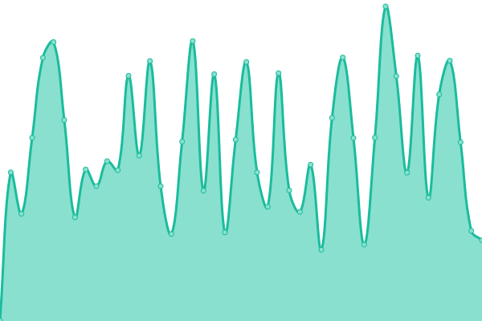
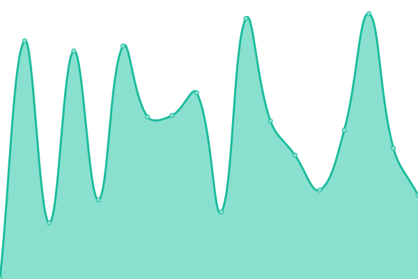
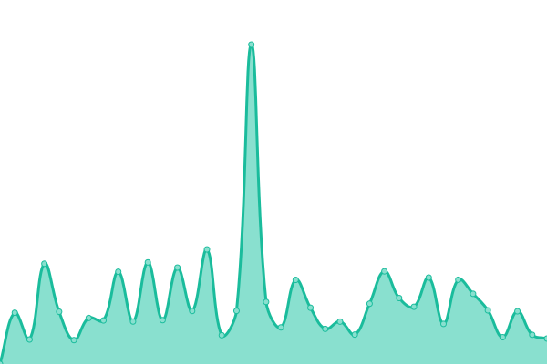
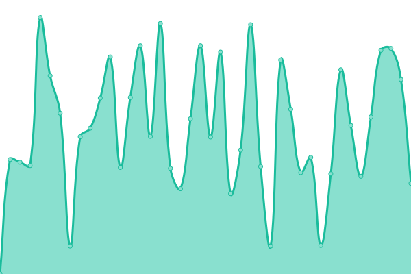

# [📈 Live Status](https://demo.upptime.js.org): <!--live status--> **🟩 All systems operational**

This repository contains the open-source uptime monitor and status page for [Upptime](https://upptime.js.org), powered by [Upptime](https://github.com/upptime/upptime).

With [Upptime](https://upptime.js.org), you can get your own unlimited and free uptime monitor and status page, powered entirely by a GitHub repository. We use [Issues](https://github.com/upptime/upptime/issues) as incident reports, [Actions](https://github.com/ajshastri/musical-waffle/actions) as uptime monitors, and [Pages](https://demo.upptime.js.org) for the status page.

<!--start: status pages-->
<!-- This summary is generated by Upptime (https://github.com/upptime/upptime) -->
<!-- Do not edit this manually, your changes will be overwritten -->
<!-- prettier-ignore -->
| URL | Status | History | Response Time | Uptime |
| --- | ------ | ------- | ------------- | ------ |
|  [Southwest Gas](https://www.swgas.com) | 🟩 Up | [southwest-gas.yml](https://github.com/ajshastri/musical-waffle/commits/HEAD/history/southwest-gas.yml) | 

 674ms
     
 | 

<a href="https://ajshastri.github.io/musical-waffle/history/southwest-gas">100.00%</a>
    

|  [NV Energy](https://www.nvenergy.com) | 🟩 Up | [nv-energy.yml](https://github.com/ajshastri/musical-waffle/commits/HEAD/history/nv-energy.yml) | 

 350ms
     
 | 

<a href="https://ajshastri.github.io/musical-waffle/history/nv-energy">99.53%</a>
    

|  [Myaccount swgas](https://myaccount.swgas.com) | 🟩 Up | [myaccount-swgas.yml](https://github.com/ajshastri/musical-waffle/commits/HEAD/history/myaccount-swgas.yml) | 

 403ms
     
 | 

<a href="https://ajshastri.github.io/musical-waffle/history/myaccount-swgas">87.12%</a>
    

|  [h1www.swgas.com](https://h1www.swgas.com) | 🟩 Up | [h1www-swgas-com.yml](https://github.com/ajshastri/musical-waffle/commits/HEAD/history/h1www-swgas-com.yml) | 

 654ms
     
 | 

<a href="https://ajshastri.github.io/musical-waffle/history/h1www-swgas-com">100.00%</a>
    

|  [h2www.swgas.com](https://h2www.swgas.com) | 🟩 Up | [h2www-swgas-com.yml](https://github.com/ajshastri/musical-waffle/commits/HEAD/history/h2www-swgas-com.yml) | 

 715ms
     
 | 

<a href="https://ajshastri.github.io/musical-waffle/history/h2www-swgas-com">100.00%</a>
    

<!--end: status pages-->

[**Visit our status website →**](https://demo.upptime.js.org)

## 📄 License

- Powered by: [Upptime](https://github.com/upptime/upptime)
- Code: [MIT](./LICENSE) © [Upptime](https://upptime.js.org)
- Data in the `./history` directory: [Open Database License](https://opendatacommons.org/licenses/odbl/1-0/)
